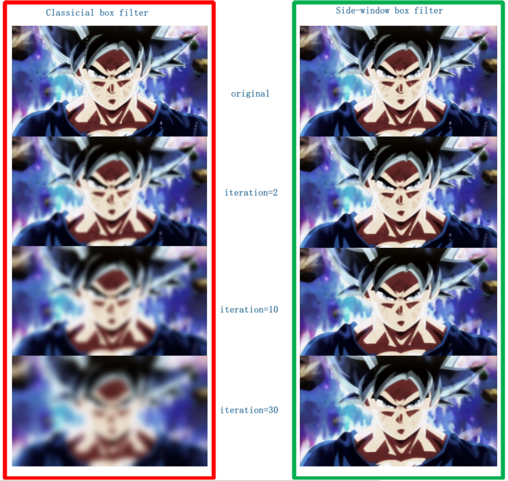
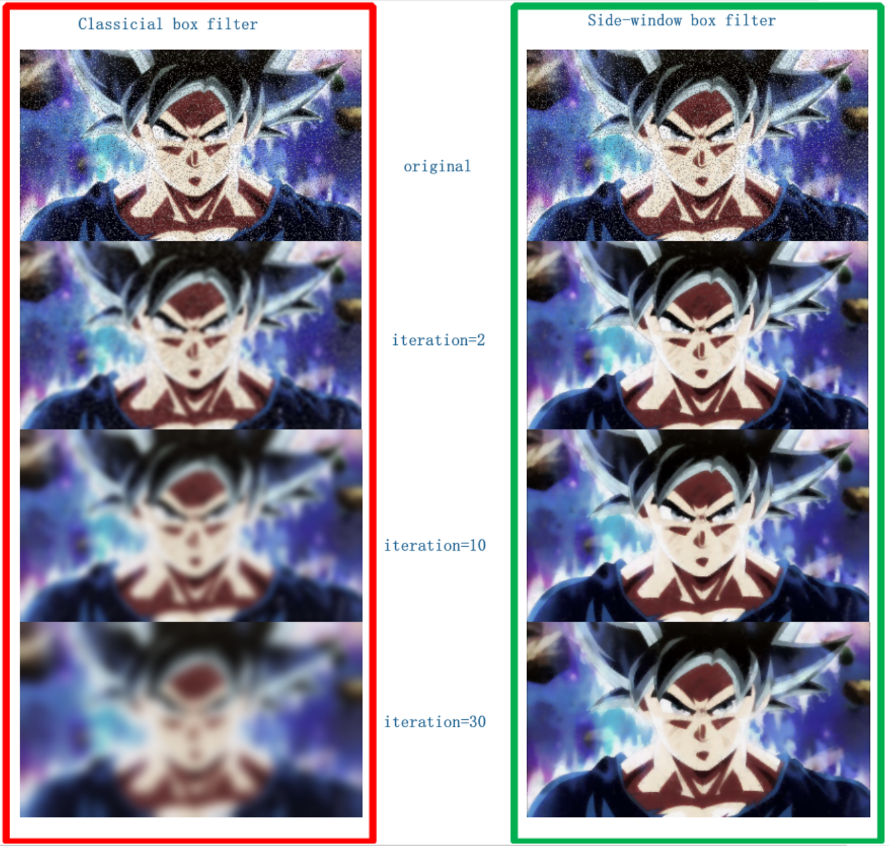

# Side-window Box Filter

C++ implementation of the [Side Window Filtering(CVPR 2019)](https://github.com/YuanhaoGong/SideWindowFilter). Successfully build on linux and android.

## Some results
The original box filter does not preserve edges. But side window box filter can preserve edges and corners, as shown in following figure. 

### filter normal image
<div align='center'>
  
</div>

### filter image with salt pepper noise
<div align='center'>
  
</div>

## Build

### Build linux
0. Install cmake 3.11

1. Build the project by running the `scripts/build_linux.sh` script and remember to modify the following parameter.

```
CMAKE_PATH=cmake
```

2. After successfully building the project, the executable `runUnitTests` will be executed. If every thing goes right, you should see the following outputs on your terminal.

```
[==========] Running 2 tests from 1 test suite.
[----------] Global test environment set-up.
[----------] 2 tests from netTest
[ RUN      ] netTest.boxFilterSpeedTest
          [0] BoxFilfer Cost time: 12.669ms
          [1] BoxFilfer Cost time: 14.355ms
          [2] BoxFilfer Cost time: 15.538ms
          [3] BoxFilfer Cost time: 16.838ms
          [4] BoxFilfer Cost time: 14.39ms
          [5] BoxFilfer Cost time: 13.951ms
          [6] BoxFilfer Cost time: 15.729ms
          [7] BoxFilfer Cost time: 16.12ms
          [8] BoxFilfer Cost time: 15.781ms
          [9] BoxFilfer Cost time: 15.106ms

          BoxFilfer Average Cost time: 15.0477ms
[       OK ] netTest.boxFilterSpeedTest (395 ms)
[ RUN      ] netTest.sideWindowBoxFilterSpeedTest
          [0] BoxFilfer Cost time: 156.4ms
          [1] BoxFilfer Cost time: 169.063ms
          [2] BoxFilfer Cost time: 169.741ms
          [3] BoxFilfer Cost time: 196.07ms
          [4] BoxFilfer Cost time: 185.092ms
          [5] BoxFilfer Cost time: 179.641ms
          [6] BoxFilfer Cost time: 166.167ms
          [7] BoxFilfer Cost time: 156.237ms
          [8] BoxFilfer Cost time: 171.244ms
          [9] BoxFilfer Cost time: 172.022ms

          BoxFilfer Average Cost time: 172.168ms
[       OK ] netTest.sideWindowBoxFilterSpeedTest (2413 ms)
[----------] 2 tests from netTest (2808 ms total)

[----------] Global test environment tear-down
[==========] 2 tests from 1 test suite ran. (2808 ms total)
[  PASSED  ] 2 tests.
```

### Build android

0. Install `adb` tool with following command

```
sudo apt update
sudo apt install android-tools-adb android-tools-fastboot
```

1. Download [android ndk 15c](https://developer.android.com/ndk/downloads/older_releases.html)

2. Install cmake 3.11

3. Build the project by running the `scripts/build_android.sh` script and remember to modify the following parameter.

```
BUILD_ANDROID_NDK_HOME=/mnt/d/downloads/android-ndk-r15c
DEPLOY_DIR=/data/local/tmp/ldp
CMAKE_PATH=/mnt/d/downloads/cmake-3.11.4/bin/cmake
```

4. After successfully building the project, the executable `runUnitTests` will be pushed to the folder `${DEPLOY_DIR}` on your android mobile and run. If every thing goes right, you should see the similar outputs on your terminal as you build on linux.

## Run

